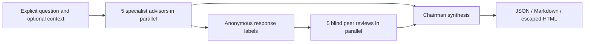

# LLM Council for Digital Marketing

[](https://github.com/mayurthebuilder/llm-council/actions/workflows/ci.yml)
[](https://github.com/mayurthebuilder/llm-council/actions/workflows/privacy.yml)
[](pyproject.toml)
[](LICENSE)

A privacy-conscious, typed Python CLI that turns one digital-marketing question into
five specialist analyses, five identity-blind peer reviews, and one structured chairman
decision. It puts digital strategy first while staying execution-aware across positioning,
growth channels, creative/content, measurement, SEO, AEO, and GEO.

> This is decision support—not an autonomous campaign publisher or an outcome predictor.
> It does not guarantee rankings, citations, traffic, leads, or revenue.

## Why this project

- **Marketing-specific council:** brand/audience, growth/channels, SEO/AEO/GEO,
  creative/content, and measurement/risk are first-class lenses.
- **Real deliberation structure:** advisors work independently; reviewers receive anonymous
  response labels; a chairman preserves consensus, dissent, assumptions, risks, and actions.
- **Offline-first demonstration:** the default provider is fixed, fictional, deterministic,
  credential-free, and zero-network.
- **Explicit privacy boundary:** the tool reads only the question and an optional context file
  explicitly named by the user. It does not search the repository, home folder, or chat history.
- **Safe outputs:** canonical JSON plus escaped Markdown and self-contained HTML, with secure
  local publication controls on supported POSIX platforms.

## SEO, AEO, and GEO

These related disciplines are not synonyms:

| Discipline | Focus |
|---|---|
| **SEO** | Crawlability, indexing, relevance, authority, and discovery in conventional search. |
| **AEO — Answer Engine Optimization** | Clear, trustworthy, answer-first information that can be eligible for featured answers and conversational retrieval. |
| **GEO — Generative Engine Optimization** | Entity clarity, original evidence, expert attribution, and retrievable/citation-worthy content for generative search experiences. |

The council recommends testable practices and calls out missing current evidence. Search and
generative systems change; no tactic can ensure a ranking, answer inclusion, citation, traffic,
or commercial result.

## One-command offline demo

Requires Python 3.11+ and Git:

```bash
git clone https://github.com/mayurthebuilder/llm-council.git
cd llm-council
python -m venv .venv
source .venv/bin/activate
python -m pip install .
llm-council run \
  --question "How should a fictional B2B SaaS launch build qualified demand?" \
  --context-file examples/digital-marketing-launch-context.md
```

The demo prints a prominent notice to stderr because its result is a **fixed simulated
response**, not an analysis of the supplied question or context. It makes no network request.
See the generated [Markdown](examples/demo-decision.md) and
[HTML](examples/demo-decision.html) reports.

For machine-readable output:

```bash
llm-council run --question "Fictional channel-mix decision" --format json
```

Notices and progress go to stderr, leaving stdout schema-only.

## How the council works



A successful real-provider run normally makes **11 generation calls**: five advisor calls,
five peer-review calls, and one chairman call. That can incur provider costs. One provider and
model may serve all roles; role prompting does **not** prove independent model diversity or
improved factual accuracy. Details and sequence boundaries are in
[docs/architecture.md](docs/architecture.md).

## Optional Google provider

The real adapter is opt-in. The documented default model is `gemini-3.7-flash`.

```bash
python -m pip install '.[google]'
export GOOGLE_API_KEY='your-key-in-your-shell'
llm-council run \
  --provider google \
  --question "Which digital channels should this fictional launch validate first?" \
  --context-file examples/digital-marketing-launch-context.md
```

The key is read from `GOOGLE_API_KEY`; question/context are sent to Google. Model availability,
pricing, quotas, and behavior can change, so verify them in current provider documentation.
The adapter is covered by mocked SDK and offline tests in this repository; no credential was
available for a live generation test for this release.

## Output and privacy boundaries

- Context is accepted only through `--context-file`, must be UTF-8, use an allowed text
  extension, stay inside the current working directory, and contain no symlink components.
- No telemetry, implicit history, cache, or prompt persistence is implemented.
- Provider/model text is untrusted and strictly parsed into Pydantic models. HTML is escaped.
- File publication uses descriptor-relative, no-follow operations tested on macOS/Linux.
  Unsupported platforms fail closed for file output; stdout rendering remains available.
- Another process can rename an already-published report directory. The writer avoids a
  destructive rollback that could remove another writer's file.
- Generated strategy can still be incomplete, outdated, biased, or wrong. Verify claims,
  platform guidance, compliance, budgets, and measurement plans before acting.

## Development and verification

```bash
python -m pip install -e '.[dev]'
python -m pytest -q --cov=llm_council --cov-report=term-missing
python -m ruff check .
python -m mypy src
python scripts/privacy_scan.py
python -m build
```

Offline evaluation fixtures check pipeline structure and marketing-specialist coverage; they do
not establish recommendation quality, discoverability, citations, rankings, or business impact.
See [CONTRIBUTING.md](CONTRIBUTING.md), [SECURITY.md](SECURITY.md), and
[CHANGELOG.md](CHANGELOG.md).

## Inspiration and license

Conceptually inspired by [Andrej Karpathy's `llm-council`](https://github.com/karpathy/llm-council).
This repository is an independent implementation; no code or assets were copied. The referenced
repository did not publish a license when this attribution was prepared, so its terms do not
apply here. This project is available under the [MIT License](LICENSE).
