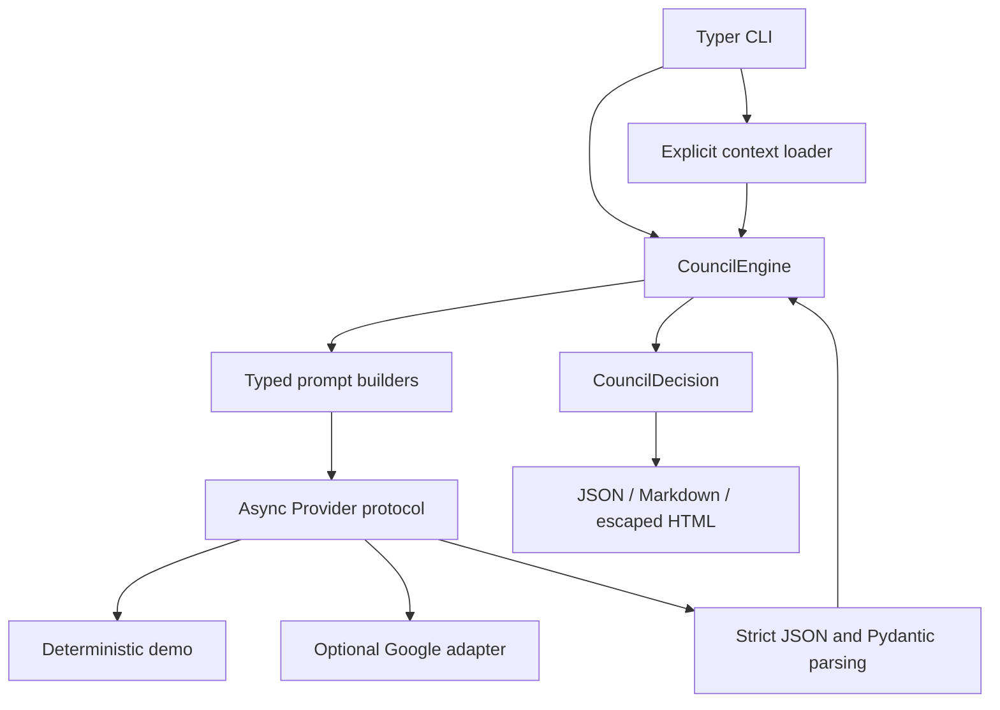
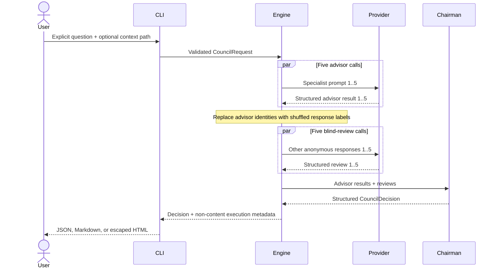

# Architecture

LLM Council for Digital Marketing separates validated domain data, provider calls,
orchestration, and presentation. The design is provider-neutral; the deterministic provider
keeps the full pipeline reproducible offline, while Google Gen AI is an optional adapter.

## Components

The default advisor lenses are brand/audience, growth/channels, SEO/AEO/GEO,
creative/content, and measurement/marketing risk. SEO concerns conventional search;
AEO concerns answer eligibility and clarity; GEO concerns generative understanding,
retrieval, and citation-worthiness. None implies a guaranteed outcome.

## Successful request sequence

A normal successful real run uses 11 generation calls. Quorum rules permit bounded partial
provider failure; otherwise the run fails without publishing a decision. Timeout and error
paths avoid returning user context, model text, or credentials.

## Trust boundaries

1. The CLI validates scalar input and output destinations before paid provider construction.
2. Only an explicit in-project UTF-8 context file is read; symlinks and traversal are rejected.
3. User context is labelled untrusted and cannot redefine system instructions.
4. Model output is size-bounded, parsed as strict JSON, and schema-validated.
5. Review candidates use anonymous labels and exclude the reviewer's own response.
6. Rendering uses fixed markup; untrusted HTML is escaped.
7. Credential values are never included in serialized decisions or safe CLI errors.

Blind labels reduce identity cues in the application payload, but cannot establish statistical
independence. Using one model for all roles also does not prove diversity or accuracy.

## File-output portability

The writer relies on POSIX descriptor-relative APIs and no-follow flags, tested on macOS/Linux.
It fails closed when those primitives are unavailable. Stdout renderers remain portable. A
separate process can rename a directory after publication; the implementation deliberately
does not perform destructive rollback by pathname.
